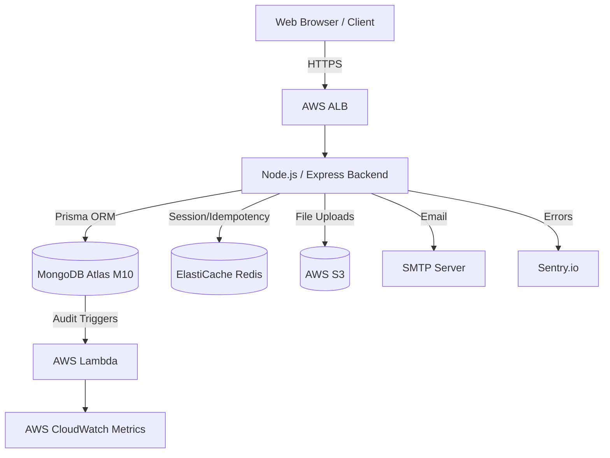

# Architecture & Security Design

This document provides a high-level overview of the Online Examination System's architecture, data flow, and Role-Based Access Control (RBAC) surface.

## 1. System Component Diagram

## 2. Role-Based Access Control (RBAC) Matrix

The system implements four distinct security contexts. The API surface is strictly segregated using JWT-based authentication and role-checking middleware (`requireAuth`, `requireRole`).

| Feature / Resource | `ADMIN` (System Owner) | `TRAINER` (Test Creator) | `INVIGILATOR` (Proctor) | `TRAINEE` (Student) | Unprotected (Public) |
|--------------------|------------------------|--------------------------|-------------------------|---------------------|----------------------|
| **System Settings** | Create/Delete Trainers, Delete Trainees (DPDP Erasure) | ❌ | ❌ | ❌ | ❌ |
| **Exam Creation** | ❌ | Create Tests, Upload Bulk Questions, Set Deadlines | ❌ | ❌ | ❌ |
| **Live Monitoring** | ❌ | View live sessions, View Audit Events | View live sessions, View Audit Events | ❌ | ❌ |
| **Taking Exams** | ❌ | ❌ | ❌ | Save Answers, Submit Exam | View Test Instructions |
| **Results Access** | ❌ | Generate & Release Results | ❌ | View Score (If Published) | ❌ |
| **Data Export** | ❌ | ❌ | ❌ | Request DPDP Data Portability | ❌ |

## 3. Unprotected Routes (Security Surface)

The following routes are intentionally exposed without authentication to facilitate onboarding and webhook integrations:
- `POST /api/v1/trainee/enter` - Public registration for a specific exam window. (Protected by strict IP-based Rate Limiting to prevent spam).
- `POST /api/v1/login` - Authentication endpoint to exchange credentials for a JWT.
- `GET /` - Basic load balancer health-check endpoint.
